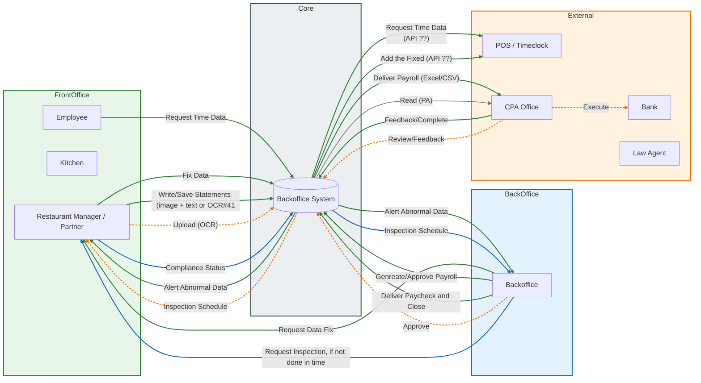

## Constitution

### 구성도2

```mermaid

flowchart LR

    %% Groups
    subgraph FrontOffice["FrontOffice"]
        direction TB
        RM[Restaurant Manager / Partner]
        K[Kitchen]
        EMP[Employee]
    end

    subgraph BackOffice["BackOffice"]
        BO[Backoffice]
    end

    subgraph Core["Core"]
        SYS[(Backoffice System)]
    end

    subgraph External["External"]
        direction TB
        POS[POS / Timeclock]
        BANK[Bank]
        CPA[CPA Office]
        LAW[Law Agent]
    end

    %% Subgraph styles (must come after declarations)
    style FrontOffice fill:#E8F5E9,stroke:#2E7D32,stroke-width:2px
    style BackOffice  fill:#E3F2FD,stroke:#1565C0,stroke-width:2px
    style Core        fill:#ECEFF1,stroke:#37474F,stroke-width:2px
    style External    fill:#FFF3E0,stroke:#EF6C00,stroke-width:2px

    %% ================== FLOWS (indices 0..19) ==================
    %% Time & Payroll, 0 ~ 
    SYS -->|Request Time Data<BR> #40;API ??#41;| POS
    EMP -->|Request Time Data| SYS
    SYS -->|Alert Abnormal Data| RM
    SYS -->|Alert Abnormal Data| BO
    RM  -->|Fix Data| SYS
    BO  -->|Request Data Fix| RM
    SYS -->|Add the Fixed #40;API ??#41;| POS
    
    BO  -->|Genreate/Approve Payroll| SYS 
    SYS -->|Deliver Payroll #40;Excel/CSV#41;| CPA
    CPA -->|Feedback/Complete| SYS
    BO  -->|Deliver Paycheck and Close| SYS
    

    %% Expense / AP, 12~ 
    RM  -->|Write/Save Statements #40;image + text or OCR#41| SYS
    RM  -->|Upload #40;OCR#41;| SYS
    BO  -->|Approve| SYS
    CPA -->|Review/Feedback| SYS
    CPA -->|Execute| BANK

    %% Calendar / Compliance, 17~
    SYS -->|Inspection Schedule| RM
    SYS -->|Inspection Schedule| BO
    RM  -->|Compliance Status| SYS
    %% LAW -->|Request Inspection #40;email#41;| BO
    BO  -->|Request Inspection, if not done in time| RM
    
    %% Visibility, 20
    SYS -->|Read #40;PA#41;| CPA

    %% Edge styles (after all links)
    linkStyle 0,1,2,3,4,5,6,7,8,9,10,11 stroke:#2E7D32,stroke-width:2px
    linkStyle 12,13,14,15,16 stroke:#EF6C00,stroke-width:2px,stroke-dasharray:4 3
    linkStyle 17,18,19 stroke:#1565C0,stroke-width:2px
    linkStyle 20 stroke:#757575,stroke-width:1.5px


```

