## Time Data and Payroll

* Time data is automatically confirmed in n-th day. 
	* Abnormal time data is alerted to RM and BO in the next day.
	* If nobody claims before n-th day, time data is automatically confirmed. 
	* This rule is announced. 

* CPA dashboard will have all button for confirming all record, but every record is processed individually per staff
* Payroll is by check, jello, venmo, paypal, or what else ?? 
* BO prints bank checks. 
* Who transfer money in case of jello, venmo, paypal, bank-wiring, and etc ? 

```mermaid

%%{init: { "sequence": { "messageMargin": 40, "diagramMarginY": 24 } }}%%
sequenceDiagram
    autonumber
    participant POS as POS / Timeclock
    actor       EMP as Employee
    actor       RM  as Manager / Partner
    participant SYS as Backoffice System
    actor       BO  as Backoffice
    actor       CPA as CPA

 
    Note over POS,CPA: Time Data
    
    SYS ->> POS: 🟢 Time Data: Request Data #40;API ??#41;
    EMP ->> SYS: 🟢 Time Data: Request Data #40;API#41;

    rect rgba(255,224,178,0.45)
    alt Correct if EMP or RM detects abnormal data
        %% EMP ->> SYS: Time Data: Request Fix or Confirm
        RM  ->> SYS: Time Data: Approve Fix
        SYS ->> RM : Time Data: Alert Abnormal
        SYS ->> BO : Time Data: Alert Abnormal
        RM  ->> SYS: Time Data: Fix #40;Reason#41;

        %% Required? 
        SYS ->> POS: Time Data: Update Fix #40;Reason#41
        alt BO request review for correction if abnormal data is not fixed ins 2 days
            BO  ->> RM : Time Data: Request Review
        end
    end
    end
    SYS ->> SYS: 🟢 Time Data: Automatically Confirm in 5 days

    %% Payroll
    Note over POS,CPA: Payroll
    
    rect rgba(255,224,178,0.45)
	loop if Reject
		BO  ->> SYS: Payroll: 🟢 Generate Approval Process
		SYS ->> RM : Payroll: 🟢 Request Consent
		RM  ->> SYS: Payroll: 🟢 Consent or ❌ Reject
		SYS ->> BO : Payroll: 🟢 Request Approval
		BO  ->> SYS: Payroll: 🟢 Approve or ❌ Reject
	end
	end
	BO  ->> SYS: Payroll: 🟢 Generate Payroll Excel/CSV
	SYS ->> CPA: Payroll: 🟢 Deliver Payroll Excel/CSV
	

	rect rgba(255,224,178,0.45)
	alt for items to need review
		CPA ->> SYS: Payroll: Add Feedback
		SYS ->> BO : Payroll: Notify Feedback
		CPA ->> SYS: Payroll: Rollback Confirm
	else for good items
		CPA ->> SYS: Payroll: Confirm #40;check, ??#41;
	end
	end
	
	BO  ->> SYS: Payroll: 🟢 Deliver and Close Confirmed Items

```

